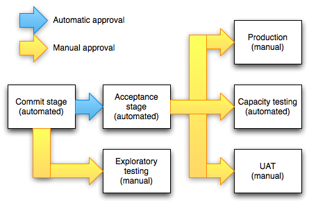

class: inverse, center, middle

# CI/CD implementálása Maven/Gradle, Jenkins/GitLab és Docker/Kubernetes eszközökkel

---

class: inverse, center, middle

# DevOps

---

## Klasszikus <br /> szállítási folyamat (release)

* Felhasználók igénybe tudják venni
* Lépései (módszertantól függetlenül)
  * Követelmény felmérés (funkcionális és nem-funkcionális - minőségi (quality attributes) követelmények)
  * Tervezés
  * Implementálás
  * Tesztelés
  * Telepítés
* Folyamatosan meg kell figyelni (observing)

---

## Megjelenhetnek 

* További követelmények
* Funkcionális hibák
* Performancia problémák

---

## Elvárások és problémák

* Gyors és magas minőségű (hiba nélküli) értékes szállítás
* Klasszikus problémák
  * Kommunikációs problémák a fejlesztők és az üzemeltetés között
  * Különböző célok: fejlesztés és stabilitás (gyakran bürökratikus eszközök, dokumentációk, checklistek)
  * Biztonsággal kapcsolatos elvárások
  * Tesztelés (pl. manuális tesztelés)
* Nagyon sok manuális munka: emberek gyengék ezek elvégzésében, számítógépek jók
  * Könnyű hibát véteni
  * Tudásmegosztás bonyolult (wiki)
  * Átláthatatlan, auditálhatatlan
  * Ismételhetetlen

---

## DevOps

* Gondolkodásmód, gyakorlatok, eszközök összessége
* Gyors és magas minőségű szállításra
* Akár a napi többszöri szállítás elérése
* Kommunikáció, kollaboráció
* Automatizálás
* Átláthatóság
* Megvalósítása cégenként változik


---

## DevOps engineer

* Gyakori DevOps minta
* Szerepkör
* Sokan ellenzik a létjogosultságát
* Feladata: szállítási folyamat megalkotása

---

class: inverse, center, middle

# Continuous Delivery

---

## Continuous Delivery

* A DevOps központi eleme
* Elvek és gyakorlatok összessége
* Értékes és robosztus szoftver kiadására
* Rövid ciklusokban
* Funkcionalitás apró darabokban kerül hozzáadásra
* Bármelyik pillanatban (potenciálisan) szállítható
  * Amiről az üzlet dönthet
* Alapja: Jez Humble, Dave Farley: Continuous Delivery (Addison-Wesley, 2010)
* Technológiai és szervezeti vonatkozásai
* Daniel Bryant, Abraham Marín-Pérez: Continuous Delivery in Java (O'Reilly, 2018)

---

## Pipeline

* Eszköze az automatizált, ismételhető, megbízható build pipeline
  mely a változtatás szállítását végzi
* Tipikus feladatok
	* Fordítás
  * Unit tesztek
	* Csomagolás (package), manapság gyakran konténer image-be
	* Publikálás (repo-kba - deploy)
  * Tesztelés: automata és manuális
    * Statikus kódellenőrzés/tesztelés
    * Funkcionális tesztek, lsd. teszt piramis (unit, integrációs, end-to-end), tesztlefedettség, stb.
    * Nem-funkcionális követelmények tesztelése (teljesítmény és biztonsági tesztek)
	* Telepítés különböző környezetekbe, beleértve az adatbázis migrációkat is (deploy)

---

## Gyors visszajelzések előnyei

* Gyors visszajelzés
	* Üzleti oldalról
	* Technológiai oldalról
* Minél koraibb visszacsatolás, annál kisebb a hibajavítás költsége
* Hibajavításkor nem nagyon régi kódhoz kell visszanyúlni
* Csökken a context switch költsége

---

## Ellenpélda

* Megbízhatatlan, körülményes, manuális telepítési folyamat
* Kiadás elodázása
* Big bang release
* Lassú visszajelzés

---

## Metrikák

* Milyen gyakran történik szállítás?
* Mennyi idő alatt kerül ki egy módosítás az élesbe?
* Mennyi a sikertelen kiadások aránya?
* Hiba esetén általában mennyi a helyreállítás ideje?

[DevOps Research and Assessment](https://dora.dev/)

---

## Continuous Integration

* Elkészült kód naponta többszöri integrálása
* Verziókövető rendszerbe való feltöltés, fordítás, 
  esetleg a tesztesetek futtatása
* A CD ennél több, ugyanis az pluszként elvárja, hogy az alkalmazás
  bármikor szállítható
* CI/CD nehezen értelmezhető, de széleskörben elterjedt


---

## Continuous Deployment

* Ha a módosítás után végigfut a pipeline, beleértve az automata teszteket is, akkor
  szállítható, azaz azonnal igénybe vehetik a felhasználók


Forrás: [Atlassian: Continuous integration vs. delivery vs. deployment](https://www.atlassian.com/continuous-delivery/principles/continuous-integration-vs-delivery-vs-deployment)


---

class: inverse, center, middle

# Pipeline és legjobb gyakorlatok

---

## Pipeline

<p></p>
<p></p>

Forrás: [Jez Humble: Deployment pipeline anti-patterns](https://continuousdelivery.com/2010/09/deployment-pipeline-anti-patterns/)

---

## Basic pipeline


Forrás: Jez Humble, Dave Farley: Continuous Delivery (Addison-Wesley, 2010)

---

## Egy artifact megy végig

* Egy artifact megy végig: _single source of truth_
  * Amennyiben más megy ki teszt és éles környezetbe, lehet, hogy a hiba csak az egyik környezetben fog megjelenni
  * Így szoktak hivatkozni a verziókövető rendszerre is

---

## Azonos környezetek és telepítés

* Works on my machine eliminálása
* Környezetek közötti különbségek minimalizálása
* Tesztelve lesznek a telepítő szkriptek
* A konfiguráció a környezet és nem az alkalmazás része

---

## Smoke teszt a különböző <br /> környezeteken

* Elindult-e az alkalmazás az adott környezeten
* Elérhetőek-e a függőségei, pl. adatbázis, message broker, stb.

---

## Minden változtatás indítsa <br /> a pipeline-t

* Csak így deríthető melyik változtatás okozta a hibát

---

## Hiba a pipeline-ban

* Ha az egyik stage hibára fut, akkor álljon meg a pipeline

---

class: inverse, center, middle

# Konkrét pipeline és eszközök

---

## Legjobb gyakorlat

* Érdemes a pipeline stage-eit egyesével, iteratív módon fejleszteni
* Egy stage a CD eszköztől leválasztva is külön futtatható legyen
  * Könnyebb fejlesztés és tesztelés
  * Platformfüggetlenség

---

## Konkrét pipeline és eszközök


---

class: inverse, center, middle

# Build eszközök

---

## Build eszközök feladata

* Eszköz, mely képes automatizálni a következő feladatokat
  * Függőségek kezelése, letöltés repo-ból
  * Fordítás
  * Csomagolás
  * Tesztek futtatása, tesztlefedettség gyűjtése
  * Csomag deploy repo-ba
  * Egyedi automatizálandó feladatok elvégzése, mint pl. kódgenerálás, dokumentáció generálás, függőségek biztonsági ellenőrzése, stb.

---

## Build eszközök jellemzői

* Convention over configuration
* Incremental compilation
* Incremental build
* Több programozási nyelv és platform támogatása
* Multimodule
* Bővíthetőség: plugin
* IDE integráció

---

## Maven vs. Gradle

* Maven
  * De facto standard, szélesebb körben elterjedt
  * Vannak best practice-ek
  * Nehezebb testreszabni
* Gradle
  * Nagyobb flexibilitás
  * Inkrementális build, csak a megváltozott osztályokat fordítja le újra
    * Ennek megfelelően a megfelelő taskokat is képes átugorni
    * Multimodule projekteknél is működik: partial build
  * Ezért bizonyos esetekben gyorsabb
  * Nagyra növő multimodule projektekhez
  * Groovy DSL tömörebb, mint az XML

---

class: inverse, center, middle

# Maven build eszköz

---

## Alapfogalmak

* Központi eleme: `pom.xml`, Project Object Model
* Maven koordináták - GAV (`groupId`, `artifactId`, `version`)
* Öröklődés
* Properties
* Függőségek
* Pluginok

---

## Könyvtárszerkezet

```
src/
├─ main/
│  ├─ java/
│  ├─ resources/
├─ test/
│  ├─ java/
│  ├─ resources/
pom.xml
```

---

class: inverse, center, middle

# Maven futtatás

---

## Maven wrapper


```
.mvn/
├─ wrapper/
│  ├─ maven-wrapper.jar
│  ├─ maven-wrapper.properties
│  ├─ MavenWrapperDownloader.java
mvnw
mvnw.cmd
```

* Letölti és telepíti a megfelelő Maven verziót
* Nem szükséges Maven telepítése az adott gépre

---

## Életciklusok

* Clean
* Default
* Site

---

## Fázisok


---

## Maven pluginok


---

## Plugin goal fázishoz kötése


---

class: inverse, center, middle

# Maven függőségek

---

## Függőségkezelés

* Koordinátákkal adható meg

```xml
<dependency>
  <groupId>org.springdoc</groupId>
  <artifactId>springdoc-openapi-starter-webmvc-ui</artifactId>
  <version>2.1.0</version>
</dependency>
```

---

## Dependency management

* Verziószámok definiálására
*	`<dependencyManagement>` tag
*	`<pluginManagement>` tag

```xml
<dependency>
  <groupId>org.springframework.boot</groupId>
  <artifactId>spring-boot-starter-web</artifactId>
</dependency>
```

---

## Scope

```xml
<dependency>
  <groupId>org.springframework.boot</groupId>
  <artifactId>spring-boot-starter-webflux</artifactId>
  <scope>test</scope>
</dependency>
```

---

## Repository-k

*	Local Maven Repositories (cache)
*	Remote Repositories
	* Public Repositories, [Central repository](https://repo1.maven.org/maven2)
	* Internal Repositories (cache, proxy)

`/<groupId>/<artifactId>/<version>/<artifactId>-<version>.<packaging>`

---

## Telepítés a local repo-ba

* `mvnw install`

---

## Tranzitív függőségek

* `mvnw dependency:tree`


---

## Version ranges


Kerüljük a használatát!

---

## Verzió frissítések

* Maven versions plugin
* Plugin verziókkal kapcsolatos lekérdezésekre és módosításokra
* `mvnw versions:display-dependency-updates` mely függőségből van újabb verzió

---

class: inverse, center, middle

# Maven unit tesztek

---

## Maven unit tesztek futtatása

* Surefire plugin
  * Több unit teszt keretrendszert is támogat (JUnit, TestNG)
  * Riportokat generál txt és xml formátumban
  * Szűrni lehet a tesztekre különböző feltételek alapján (pl. groups/category/tags)
  * Képes teszteket párhuzamosan futtatni
  * Hiba esetén képes teszteket újrafuttatni
* `src/test/java` könyvtárban
* `2.22.2`-től JUnit 5 támogatás
* Tesztek átugrása: `mvn package -DskipTests`

---

class: inverse, center, middle

# Gradle build eszköz

---

## Alapfogalmak

* Groovy-based DSL
* Alapfogalma a _project_ melynek építőelemei a _task_-ok
* Taskok gráfja (DAG - directed acyclic graph)
* Hogy ne kelljen a taskokat újra megírni és másolgatni, vannak a pluginok
  * [Java plugin](https://docs.gradle.org/current/userguide/java_plugin.html)

---

class: inverse, center, middle

# Gradle futtatás

---

## Gradle wrapper


```
gradle/
├─ wrapper/
│  ├─ gradle-wrapper.jar
│  ├─ gradle-wrapper.properties
gradlew
gradlew.bat
```

* Letölti és telepíti a megfelelő Gradle verziót

---

## Lifecycle

Nincs, csak plugin szinten


---

class: inverse, center, middle

# Gradle függőségek

---

## Függőségkezelés

* Maven koordináták - GAV (`groupId`, `artifactId`, `version`)
* A függőségek _dependency configuration_-ökbe vannak szervezve
  * compileOnly — for dependencies that are necessary to compile your production code but shouldn't be part of the runtime classpath
  * implementation (supersedes compile) — used for compilation and runtime
  * runtimeOnly (supersedes runtime) — only used at runtime, not for compilation
  * testCompileOnly — same as compileOnly except it’s for the tests
  * testImplementation — test equivalent of implementation
  * testRuntimeOnly — test equivalent of runtimeOnly

---

## Repository-k

*	Remote Repositories
	* Public Repositories, [Central repository](https://repo1.maven.org/maven2)
	* Internal Repositories (cache, proxy)

`/<groupId>/<artifactId>/<version>/<artifactId>-<version>.<packaging>`

* Lokális cache könyvtár

---

## Tranzitív függőségek

* `gradlew -q dependencies`

---

## Version ranges

* Maven típusú, pl.: `[1.0,)`, `[1.1, 2.0)`, `(1.2, 1.5]`
* Prefix, pl.: `1.+`, `1.3.+`
* Kerüljük a használatát!

---

## Verzió frissítések

* [Gradle Versions Plugin](https://github.com/ben-manes/gradle-versions-plugin)

---

## Gradle projekten átívelő <br /> függőségek

* [Gradle Dependency Management Plugin](https://github.com/spring-gradle-plugins/dependency-management-plugin)
* Spring kapcsán fejlesztették ki

---

class: inverse, center, middle

# Gradle unit tesztek

---

## Gradle unit tesztek futtatása

* Több unit teszt keretrendszert is támogat (JUnit, TestNG)
* Képes teszteket párhuzamosan futtatni
* Beállítható, hogy az első hibánál leálljon-e
* Szűrni lehet a tesztekre különböző feltételek alapján (pl. groups/category/tags)
* Riportokat generál xml és html formátumban (közbülső bináris formátumot használ)
* `src/test/java` könyvtárban

---

class: inverse, center, middle

# Tesztlefedettség

---

## Tesztlefedettség

* Annak mérése, hogy a tesztek futtatása során mely utasítások futottak le
* Szoftver metrika
* White box technika
* Automata teszteléshez köthető
* Különbőzőképpen mérhető: sor, elágazás
* Jacoco
* Jacoco Maven Plugin, Jacoco Gradle Plugin
* Instrumentálással, Java agent
* Bináris fájl
* Riport

---

class: inverse, center, middle

# Csomagolás

---

## Csomag típusok - jar

* jar - függőségek nélkül
* Fat ("Uber") jar - függőségekkel
  * Maven Shade Plugin
  * Maven Assembly Plugin
  * Gradle Shadow plugin
* Skinny jar - függőségekre hivatkozás a `manifest.mf` fájlban
  * Deploykor nehézkes a Fat jar mozgatása
  * Maven SlimFast Plugin
  * Külön a jar és külön könyvtárban a függőségek

---

## Csomag típusok - war

* war - függőségek egy része az alkalmazásszerver részei
* Skinny war - 3rd party libek külön

---

## Csomagolás - Spring Boot

* Spring Boot Maven Plugin, Spring Boot Gradle Plugin
* Fat jar és war csomagolást is támogat
* A jar függőségekkel együtt, Tomcat is belecsomagolva

---

class: inverse, center, middle

# Bevezetés a Docker használatába

---

## Konténerizáció

* Teljes alkalmazás szállítása a környezetével együtt
* Analógia: szabványosítás konténerekkel a szállítmányozásban
* Artifact: image, futtatva: konténer

---

## Docker

* Operációs rendszer szintű virtualizáció
* Jól elkülönített környezetek, saját fájlrendszerrel és telepített szoftverekkel
* Jól meghatározott módon kommunikálhatnak egymással
* Kernelt nem tartalmaz, hanem a host Linux kernel izoláltan futtatja
   * Linux kernel cgroups és namespaces képességeire alapozva
* Kevésbé erőforrásigényes, mint a virtualizáció

---

## Docker


---

## Docker felhasználási módja

* Saját fejlesztői környezetben reprodukálható erőforrások
  * Adatbázis (relációs/NoSQL), cache, kapcsolódó rendszerek <br /> (kifejezetten microservice környezetben)
* Jól használható automata teszteknél
* Portabilitás (különböző környezeten futattható, pl. saját gép, <br /> privát vagy publikus felhő)

---

## Docker Hub

* Publikus szolgáltatás image-ek megosztására

---

## Docker fogalmak


---

class: inverse, center, middle

# Nexus

---

## Nexus

* Sonatype Nexus Repository OSS vs. Pro
* Különböző repo formátumok
* Repo típusok:
  * Hosted
  * Proxy
  * Group
* GUI
* Search
* Role-Based Access Controls
* REST API
* Automated Cleanup Policies
* Docker konténerben futtatható

---

## Támogatott repo formátumok

* Maven
* npm
* PyPi
* Nuget
* Docker
* Helm
* APT (Debian), APK (Alpine), Yum (RPM)

---

---

class: inverse, center, middle

# Artifactory repo manager

---

## JFrog Artifactory

* Artifactory OSS vs. Pro, stb.
* Különböző repo formátumok
* Repo típusok:
  * Local
  * Remote
  * Virtual
* GUI
* Search
* Role-Based Access Controls
* REST API
* Backup
* Export/Import

---

## Támogatott repo formátumok

* Generic
  * Egyszerű fájl tárolásra
  * Nem ismert repository proxy-zására
* Gradle
  * Deprecated - Gradle 1-ben használt repo típus
* Ivy
* Maven
* SBT - Scala
* Csak a kereskedelmi verzióban
  * Docker, Helm, Npm, NuGet, Pypi

---

class: inverse, center, middle

# Tesztelési módszerek

---

## Tesztpiramis


* Unit tesztek: adott programozási nyelv legkisebb részeit tesztelik (nincs adatbázis)
* Integrációs tesztek: csoportba szervezett egységek tesztelése, nem nyúlik át másik rendszerekbe (lehet adatbázis)
* E2E: szoftverrendszer tesztelése adott környezetben, külső függőségeivel integrálva, funkciók, folyamatok tesztelése az elejétől a végéig

---

class: inverse, center, middle

# Integrációs tesztek

---

## Integrációs tesztek in-memory adatbázison

* H2 adatbázis, Javaban implementált, alkalmazással egy JVM-ben
* Nagyon gyors
* Kb. 2,5 MB méretű jar fájl
* Szabvány SQL támogatás
* Kompatibilitási módok: IBM DB2, Apache Derby, HSQLDB, MS SQL Server, MySQL, Oracle, PostgreSQL

---

## Integrációs tesztek <br /> valós adatbázison

* Létező infrastruktúrán
* Build tool indítsa el integrációs tesztek futtatása előtt, akár konténerizálva
* [Testcontainers](https://www.testcontainers.org/)
* Minden esetben konfigurálhatóvá kell tenni a kapcsolódási paramétereket
  * Pl. parancssori paraméter vagy környezeti változó

---

class: inverse, center, middle

# Csomagolás Docker Image-be Dockerfile használatával

---

## Saját image összeállítása

* `docker build` parancs használatával
* `Dockerfile` alapján
* Kiindulási image
  * [Melyik JDK-t válasszam?](https://stackoverflow.com/questions/52431764/difference-between-openjdk-and-adoptium-adoptopenjdk)
* Munkakönyvtár megadása
* Alkalmazás másolása
* Konténer indulásakor végrehajtott parancs

```dockerfile
FROM eclipse-temurin:17
WORKDIR /app
COPY target/employees-1.0.0.jar employees.jar
#COPY build/libs/employees-gradle-1.0.0.jar employees.jar
CMD ["java", "-jar", "employees.jar"]
```

---

class: inverse, center, middle

# Docker layers

---

## Layers


---

## Legjobb gyakorlat

* Külön változó részeket külön layerbe tenni
* Operációs rendszer, JDK, libraries, alkalmazás saját fejlesztésű része külön <br /> layerbe kerüljön

---

## Dockerfile

* [Multi-stage build](https://docs.docker.com/develop/develop-images/multistage-build/)

```dockerfile
FROM eclipse-temurin:17 as builder
WORKDIR /app
COPY target/employees-1.0.0.jar employees.jar
#COPY build/libs/employees-gradle-1.0.0.jar employees.jar
RUN java -Djarmode=layertools -jar employees.jar extract

FROM eclipse-temurin:17
WORKDIR app
COPY --from=builder app/dependencies/ ./
COPY --from=builder app/spring-boot-loader/ ./
COPY --from=builder app/snapshot-dependencies/ ./
COPY --from=builder app/application/ ./
CMD ["java", "org.springframework.boot.loader.JarLauncher"]
```

---

## Layers ellenőrzése

`docker image inspect employees`


---

class: inverse, center, middle

# Deploy Docker image to Nexus

---

## Deploy Docker image to Nexus

* Create Docker hosted repository (port `8082`)
* Adminisztrációs felületen: _Nexus Security / Realms_ tabon: _Docker Bearer Token Realm_ hozzáadása

```shell
docker tag employees localhost:8092/employees
docker login localhost:8092
docker push localhost:8092/employees
```

---

class: inverse, center, middle

# YAML formátum

---

## Példa YAML állomány

```yaml
# Ez egy példa YAML állomány
title: My Example YAML
author:
  name: John Doe
  age: 30
  profession: Developer
details:
  - category: Technology
    subcategory: Programming
    languages:
      - Python
      - JavaScript
      - Ruby
  - category: Science
    subcategory: Physics
    topics:
      - Quantum Mechanics
      - Thermodynamics
      - Astrophysics
```

---

## YAML

* YAML Ain't Markup Language
* Serialization language
* Adatok platformfüggetlen tárolására, átvitelére
* Strukturált
* Ember és számítógép által is jól olvasható
* Struktúra:
  * Sortörésekkel
  * Behúzásokkal
* IDE plugin

---

## Szintaxis

* Kulcs-érték párok
* Adattípusok:
  * String: nem szükséges határoló karakter, de használható aposztróf és idézőjel is
    * Speciális karakterek esetén kell határoló, pl `\n`
  * Multi-line strings
    * Pipe (`|`) karakterrel
    * `>` karakterrel nem veszi figyelembe a sortöréseket
  * Boolean (`true`, `false`, `yes`, `no`, `on`, `off`)
  * Objektum, behúzással
  * Lista, kötőjellel (behúzás itt opcionális)
* Megjegyzés `#` karakterrel
  * Sorvégi

---

class: inverse, center, middle

# E2E UI tesztelés Selenium WebDriverrel

---

## E2E UI tesztelés

* Mi is az a UI tesztelés?
* Teljes infrastruktúra elindítása (adatbázissal, alkalmazással)
* Egyszerűsít: Docker compose
* UI teszt eszköz
  * Selenium
  * Cypress
  * Playwright
  * Puppeteer

---

## Selenium WebDriver

* Platformfüggetlen (Windows, Apple OS X, Linux, pl. Ubuntu)
* Képes meghajtani a különböző böngészőket is (Firefox, Internet Explorer, Safari, Opera, Chrome)
* Nyílt forráskódú, ingyenes
* Széles körben elterjed
* Selenium WebDriver: böngészővezérlés (pl. programozási nyelvekből API-n keresztül)

---

## Konténerizált futtatás


* Virtuális ablakkezelő (Xvfb, X virtual framebuffer) - memóriában végzi a műveleteket, nem a képernyőn
  * Headless mode
* Videófelvételi lehetőség
* Teszt esetekben konfigurálható, hova kapcsolódjanak (pl. környezeti változóban)
* Várakozás, hogy elinduljon az alkalmazás

---

class: inverse, center, middle

# E2E API tesztelés Postman/Newman használatával

---

## E2E API tesztelés

* Mi is az az API tesztelés?
* Teljes infrastruktúra elindítása (adatbázissal, alkalmazással)
* Egyszerűsít: Docker compose
* API teszt eszköz
  * Postman
  * Cypress
  * REST-assured
  * SoapUI

---

## Postman 1.

* Teljes API életciklus kezelés
  * Nem csak manuális tesztelés
* Fizetős funkciók
* Verziókezelés
* Különböző protokollok támogatása (REST, GraphQL, gRPC, WebSocket)
* OpenAPI értelmezése
* Különböző autentikációs metódusok támogatása
* Környezetek támogatása
* Automata tesztek írása
* Data driven testing

---

## Postman 2.

* API verziózás támogatása
* Generálás különböző nyelveken
* Vizualizáció
* No-Code: Flow
* Cloud szolgáltatások
  * Monitorozás
  * Mock server
  * Csoportmunka

---

## Newman

* Parancssori futtatás
* Newman vs. Postman CLI
* Várakozni, hogy elinduljon az infrastruktúra

---

class: inverse, center, middle

# SonarQube

---

## SonarQube

* Clean Code, code quality
* Code Security
* Technical debt
* Tesztlefedettség
* Duplikációk számolása
* Static Code Analysis rules ezrei
* 30+ különböző nyelv
* Project overview
* History
* CI/CD integráció

---

## SonarQube architektúra

* Embedded Elasticsearch
* Embedded H2
* Java folyamatok
    * Compute Engine
    * Elasticsearch
    * Web (including embedded web server)

---

## Rules

* Types:
    * Code Smell (Maintainability domain)
    * Bug (Reliability domain)
    * Vulnerability (Security domain)
    * Security Hotspot (Security review domain)
* [Beépített tagekkel](https://docs.sonarqube.org/latest/user-guide/built-in-rule-tags/) rendelkeznek, pl.:
    * CWE Top 25: SonarQube is a CWE compatible product since 2015.
    * PCI DSS (versions 4.0 and 3.2.1)
    * OWASP Top 10
    * OWASP ASVS (version 4.0)
    * https://en.wikipedia.org/wiki/CERT_Coding_Standards
    * Lehet hozzá taget adni
* Ki lehet egészíteni a leírást: Extend Description

---

## SonarQube Quality Profiles

* Összegyűjtött szabályok
* Java / Sonar way
* Saját hozható létre
* Projektekhez rendelhető
* Jó defaultot ad
* Changelog
* Compare
* Back up (Restore a Quality Profiles / Java felületen)
* Set as default

---

## SonarQube Quality Profiles best practices


* Érdemes minden projektre ugyanazt alkalmazni
* Ha mégis eltérnénk
    * Copy: független a kiindulási alaptól
    * Extend
        * You can only activate rules that are deactivated in the parent
        * Ha változik az eredeti, változik ez is

---

## Technical Debt

* Mennyi idő kell, ha napokban van, az 8 órás napokkal számol
* Ruleokhoz tartozó érték

---

## Quality Gates

* It focuses on keeping new code clean, rather than spending a 
 lot of effort remediating old code. 
* Conditions on New Code
* Actions
    * Create
    * Copy
* Projects
* Aszinkron adja vissza az elemzés eredményét, ezért meg kell várni

https://docs.sonarqube.org/latest/analysis/ci-integration-overview/

---

## SonarLint

* SonarLint és SonarQube integráció

---

## Build tool integráció

* SonarScanner parancssori alkalmazás
* SonarScanner for Maven
* SonarScanner for Gradle

---

class: inverse, center, middle

# DevSecOps alapjai

---

## DevSecOps

* A szállítási folyamat részese legyen a biztonság is
  * Így a pipeline része is (shift security to left)
  * Szorosabb együttműködés a szereplők között
* Legyen automatizált ez is
* Ellenőrzi
  * Függőségek
  * Licence-ek
  * Rossz programozási gyakorlatok
  * Docker base image
* Microservices: nagyobb támadási felület
* Eszközök: OWASP dependency check, SonarQube, PMD

---

## OWASP dependency check

* Dependency-check-maven Maven/Gradle plugin
* [National Vulnerability Database (NVD) hosted by NIST](https://nvd.nist.gov) alapján dolgozik
  * Első letöltés hosszabb időt vehet igénybe
  * Hetente van frissítés (konfigurálható)
  * Belső mirror használható

---

class: inverse, center, middle

# Üzemeltetési platformok

---

## Platform típusok

* Hagyományos platform
* Cloud: erőforrásokhoz való hozzáférés annak üzemeltetése nélkül
	* Osztályozás hozzáférés szerint
		* Private
		* Public
		* Hybrid
	* Osztályozás funkcionalitás szerint
		* IaaS - Infrastructure-as-a-Service
		* PaaS - Platform-as-a-Service
* Konténerek (Docker)
* Orchestration (Kubernetes)
* FaaS - Function as a Service
	
---

## Hagyományos platform

* Saját platform, operációs rendszer,
	alkalmazásszerver, adatbázis, middleware
* Gyakran a telepítés még manuálisan zajlik
* Nincs standard CD megoldás
* Gyakran nagy az üzemeltetés és a fejlesztés között a távolság
* Itt is teret hódít a virtualizáció
* Infrastructure as Code
* GitOps

---

## Cloud

* Különböző típusú komponensek (compute, storage, network, backend services)
* Sok esetben van CD service is
* Immutable infrastructure
* Tipikusan automatizált (Infrastructure as code)
* Kötöttségek PaaS esetén (pl. verziószám, paraméterezés)

---

## Konténerek

* Konténerizáció az operációs rendszer szinten megvalósítható virtualizáció vagy process izoláció
* Docker ennek egy implementációja (kiegészítve felhasználóbarát feature-ökkel és repository kezeléssel)
* Saját container platform esetén Infrastructure as code (Terraform), minden legyen verziókezelőben
* CD pipeline image-et állít elő, és ezt kell végigvinni az élesig
* Build és alkalmazás konfiguráció is a verziókezelőben

---

## Orchestration

* Tipikusan Kubernetes
* Több konténer kezelése
  * Több node-on
  * Autoscaling
* Container infrastructure as a service (CIaaS)
* Deklaratív, azaz az elvárt eredményt kell leírni
* Javaslat: sose építsd saját Kubernetes clustert, inkább használj egyet egy szolgáltatótól! 

---

## FaaS

* Klasszikus alkalmazás felépítésére nem alkalmas,
 szinkron hívásokkal
* Event Driven Architecture
* Reactive
* Az infrastuktúrát a szolgáltató adja, csak a kóddal kell foglalkozni
* Java kötöttségek (módosított JRE-ben, kontrollált fájl és hálózatelérés, time limit)
* Érdemes monitorozni a hívások számát, erőforrásszükségletet
* Nem egyszerű tanulni
* Tesztelése sem egyszerű

---

## Cloud szolgáltatók


---

class: inverse, center, middle

# Ansible

---

## Infrastructure as Code (IaC)

* Infrastruktúra konfigurációját és kezelése kódban leírva (nem feltétlenül programozási nyelvet kell érteni alatta)
* Automatizált
* Dokumentált, információmegosztás, csapatmunka
* Reprodukálható, hibamentes
* Auditálható, verziókezelhető
* Skálázható - több gépen kell elvégezni

---

## Ansible jellemzői

* Ingyenes, nyílt forráskódú
* Agentmentes, SSH-n keresztül végzi a konfigurációt
* Deklaratív: Ansible Playbookok YAML formátumban
* Moduláris architektúra: modulokat használ az egyes feladatok elvégzésére, pl. fájlkezelés, csomagkezelés, hálózati konfiguráció, stb.
* Könnyen tanulható
* Skálázható, akár több ezer gép konfigurációjára
* Multiplatform


---

class: inverse, center, middle

# Kubernetes

---

## Kubernetes

* Container orchestration (bármilyen CRI implementáció, Docker, vagy akár containerd)
* Több fizikai számítógép (resource management)
* Konténerek szétosztása, életciklus (scheduling, affinity, anti-affinity)
* Deklaratív megközelítés
* Újraindítás alkalmazás/konténer hiba esetén (service management)
* Google -> CNCF, 
* (Google) Go-ban implementált
* Különböző disztribúciók
  * On-premises és cloud megoldások is
  * Különböző gyártók
  * Különböző igények (pl. tesztelés, limitált erőforrások)
* Namespace-ekbe szervezve, pl. ugyanazon a Kubernetes clusteren különböző környezetek (ugyanazon a Kubernetes clusteren) megkülönböztetésére, pl. teszt, uat., éles, stb.

---

## Részei

* Master node (Control plane)
  * API server (REST, authentication, állapotmentes)
  * etcd (key-value adatbázis, konfiguráció és aktuális állapot)
  * Scheduler (dönt, hogy mely konténer hol indítható)
  * Controller manager (elvárt állapot fenntartásért felelős, monitoring loopok, update-eli az etcd-ben az állapotot)
  * Cloud controller manager (opcionális)
* Worker node
  * kubelet (konténerek vezérlése)
  * kube-proxy (hálózat)

---

## Hálózat

* Cluster DNS (based on CoreDNS)

---

## Magas rendelkezésreállás

* Legalább három master node (elég csak az etcd-ből)
* Legalább három worker node

---

## Windowson

* Docker Desktop
* Single node cluster

---

## Adminisztráció

* `kubectl` parancs
  * https://kubernetes.io/docs/reference/kubectl/cheatsheet/
  * Sokszor manifest fájlokat használ, melyek yaml fájlok
* GUI
* REST API, különböző programozási nyelven megírt kliensek

---

## Kustomize vs. Helm

* Kustomize
  * Konfigurációkezelő eszköz, lehetővé teszi a konfigurációs fájlok rétegezését
  * A Kustomize nem használ csomagokat vagy kötegeket, hanem az eredeti Kubernetes YAML fájlokat módosítja és kombinálja
  * Lehetővé teszi a konfigurációt különböző környezetekhez
* Helm
  * Kubernetes csomagkezelője
  * Konfigurálható telepítési egység: Chart
  * Repository-ban tárolható, megosztható, verziózható
  * Lehetővé teszi a konfigurációt különböző környezetekhez

---

class: inverse, center, middle

# Kubernetes objektumok

---

## Pod

* Bálnaraj
* Tipikusan egy konténer
* 0-n ún. sidecar konténer
* Konténerek egy ip-t kapnak (vigyázni a portütközéssel), kommunikálhatnak egymással localhoston vagy socketen
* Ideiglenes ip, hiszen bármikor történhet újraindítás
* Halandóak, ha leáll, hibára fut, Kubernetes törli és újat indít
* Atomic unit

---

## Deployment

* Inkább ezeket használjuk, bár podot is lehet
* Deployment része a pod definíció
* Skálázható
* Deployment strategy
  * Recreate - először podok törlése, majd létrehozása
  * Rolling update - Párhuzamosan, a leállási idő csökkentése miatt

---

## Service

* Egy stabil végpontot, DNS nevet, ip-címet és portot kínál
* Load-balance-ol a pod-ok között
* Típusai
  * ClusterIP - clusteren belül, nincs külső hozzáférés
  * NodePort - saját LB kell (30_000-től felfelé), automatikusan CluserIP-t is csinál
  * LoadBalancer - ráül a clusteren kívül LB-re (saját infra, vagy cloud provider), kevésbé konfigolható
  * ExternalName - DNS CNAME alapján

---

## ConfigMap, Secret

* Konfigurációs adatok tárolására
* Valamint elkülönítésére
* Kulcs-érték párokat tartalmaz
* Secret: érzékeny adatok
  * Jelszavak, tokenek, tanúsítványok
  * BASE64 kódolás
  * Nem ad teljes megoldást, mint pl. a HashiCorp Vault

---

## Persistent Volume

* Tartós adattárolás
* Független a podoktól és azok életciklusától
* Pod-ok a Persistence Volume Claimen keresztül csatlakozhatnak hozzá
* Különböző tárolómegoldásokkal működhetnek, pl. lemez, hálózati fájlrendszer, cloud

---

## StatefulSet

* Stateful alkalmazások esetén
* Hasonló, mint a Deployment, de biztosítja a Pod-ok egyediségét és sorrendiségét
* Akkor használjuk, ha szükség van valamelyikre:
  * Fix hálózati azonosító
  * Állandó, perzisztens tár
  * Sorrendezett telepítés és skálázás
  * Sorrendezett frissítés
* Pl. adatbázisok, fájlszerver, üzenettovábbítás

---

class: inverse, center, middle

# Verziókezelés és Trunk-Based Development

---

## Verziókezelés

* Forráskód, erőforrás állományok, tesztesetek, konfigurációk
* Single source of truth

---

## Monorepo vagy multiple <br /> repositories

* Egyben látható, kezelhető
* Segíti a tudásmegosztást, kódújrafelhasználást,
átláthatóságot
* Egyszerűbb lehet a projekteken átívelő tesztek felépítése
* Egyszerűbb a projekteken átívelő módosítások kezelése
* Elrettentő lehet
* Túl nagy méret, feature branch
* Eszközök, pl. Maven nincs kellően felkészítve rá

---

## Trunk-Based Development <br /> For Smaller Teams


* Egy branch, `main` (régebben `master`)
* Centralized workflow

Forrás: https://trunkbaseddevelopment.com/branch-for-release/

---

## Trunk-Based Development <br /> tulajdonságok

* Kis méretű sztorik
* Feature flagek alkalmazása
* Elősegíti a csapatmunkát, bizalmat
* Nincs merge conflict
* Nagyon támaszkodni kell az automata tesztekre
* Javasolt:
  * Kis méretű csapatnál
  * CD szemponjából ez a preferált
  * Tapasztalt fejlesztők
  * Új funkciók gyors szállításánál

---

## Feature flag

* Kódban megmarad a régi és az új működés is
* Legegyszerűbb: új menüpont elrejtése, megjelenítése
* Elágazások a kódban, feltétel alapján
  * Szerepkör alapján
  * Black/white list
  * IP-cím alapján
* Deploy vs. release
  * Attól, hogy kikerül éles környezetbe, még nem biztos, hogy használatba veheti a felhasználó
  * Elválik a szereplő, hogy ki release-elheti ki
* Használható A/B tesztelésre is
* Gondoskodni kell a flagek kivezetéséről

---

class: inverse, center, middle

# Branch-elési stratégiák

---

## Trunk-Based Development @ Scale


* Feature branch workflow
* GitHub Flow

---

## Trunk-Based Development @ Scale tulajdonságok

* Jól beilleszthető a code review és continuous integration (merge request)
* Jól követhető, hogy ki min dolgozik
* Merge kevés kockázattal jár
* Javasolt:
  * Legreálisabb
  * Illeszkedik a CD-hez

---

## Forking

* Repo lemásolása, munka saját repo-ba
* Kis csapat felelős a projektért, de sok külsős fejlesztő
* Javasolt:
  * Főleg open-source projekteknél

---

## Release branching

* Release-enként egy branch, melyen történik is fejlesztés
* Itt már bejön a merge

---

## Git Flow


---

## Git Flow branch-ek

* Két fő branch: `main` (élesen lévő), `develop` (élesen lévő és azóta történt módosítások),
* Feature branches, elkészülte után vissza a `develop`-ra
* Release branches, `develop`-ról
* Hotfix branches

Forrás: https://www.flagship.io/git-branching-strategies/

---

## Git Flow tulajdonságok

* Független fejlesztés és szállítás
* Akár párhuzamosan több release-en is történhet a fejlesztés
* Nagyon gyakori lehet a merge conflict
* Régi branch-ek kezelése problémás lehet
* Spaghetti git history
* Nem támogatja a CD-t
* Sokan miért nem érzik problémásnak?
  * Nem ők végzik a merge-öt
* Egyik leggyakrabban használt
* Javasolt
  * Ha a fejlesztési ciklus release orientált
  * Nagyobb csapatoknál

---

## Environment branching

* Különböző környezekhez különböző branchek
* GitLab Flow

---

## OneFlow


* Egyszerűsít: összevonja a `main` és `develop` branch-et

Forrás: https://betterprogramming.pub/a-simple-git-repository-strategy-93a0c7450f23


---

class: inverse, center, middle

# Jenkins

---

## Jenkins

* Egyik legrégebbi és legelterjedtebb CI/CD eszköz
* Ingyenes, nyílt forráskódú
* Nagyon sok plugin
* Skálázható (master és agents) 
* Pipelines "as code", DSL: `Jenkinsfile`
* Stage-ek, melyek step-ekből állnak
* Kétféleképp adható meg
  * Scripted: régebbi, Groovy nyelven adható meg
  * Declarative: szigorúbb struktúra, limitáltabb, egyszerűbb elkezdeni
* Felkészítve konténerizált könyezetre
  * Docker konténerben futtatható
  * Buildek külön Docker konténerben futtathatóak

---

class: inverse, center, middle

# GitLab

---

## GitLab

* Ingyenes (nyílt forráskódú) és kereskedelmi verziója is létezik
* Telepíthető, de szolgáltatásként is igénybe vehető
* Jól dokumentált
* Webes felhasználó felület
* Több feladatot is képes ellátni
  * Git verziókezelés, merge request
  * CI/CD
    * Külön komponens: GitLab Runner
    * Docker és Kubernetes támogatás
    * Stage-ek és jobok
* Issue tracking
* Wiki

---

class: inverse, center, middle

# Helm

---

## Helm

* Nyílt forráskódú csomagkezelő a Kuberneteshez
* Alapegysége a chart, mely egy könyvtár, fájlokkal, alkönyvtárakkal, akár tgz állományba csomagolva
  * Leírják az egy alkalmazáshoz tartozó Kubernetes objektumokat
* A konfigurációs beállítások kiemelhetők, és ezek az értékek a template-kben használhatóak
  * Pl. parancssori paraméterből, fájlból felülírhatóak
* Template-ek támogatják az elágazást és a ciklust
* Lehet benne definiálni a függőségeket 
* Támogatja a repository-k kezelését, feltöltést, letöltést, könnyű megosztást
* Alkalmazás könnyen telepíthető, frissíthető és visszavonható (rollback)
  
---

class: inverse, center, middle

# Telemetria

---

## Telemetria

* Observability, monitoring: megfigyelhetőség, monitorozás
* Adott (főleg éles) környezetben lévő alkalmazás megfelel-e a funkcionális és nem funkcionális követelményeknek
* Telemetriai adatok
  * Metrikák (metrics)
  * Nyomkövetés (traces)  
  * Napló (logs)
* Instrumentálás, generálás, gyűjtés és exportálás
* Jól jön hibakereséshez
* Formálódó projekt: OpenTelemetry 
  * Nyílt forráskódú
  * Keretrendszer támogatás: Spring, ASP.NET Core, Express, Quarkus, stb.

---

## Metrics

* Pillanatnyi mérőszám
* Pl.
  * CPU, memóriafelhasználás
  * Beérkezett kérések száma
  * Min., max., átlagos válaszidő
  * Párhuzamos kérések száma

---

## Traces

* Mi történik egy kérés során az alkalmazáson belül, sőt alkalmazásokon átnyúlva


---

## Traces fogalmak

* Kérés - trace
* Első komponens kiad egy azonosítót (trace id), ahhoz csatlakozik a többi
* Mindegyik részfeladat egy unit of work - span
* Alkalmazásokon átnyúlva
  * Distributed tracing
  * Context propagation
    * Pl. http header, message header, stb.

---

## Logs

* Időbélyegzett szöveges üzenet
* Strukturált (javasolt) vagy strukturálatlan
* Tartalmazhat trace és span id-kat

---

class: inverse, center, middle

# CI/CD kihívásai microservice környezetben

---

## Microservices

* Több service
* Több pipeline
* Próbáljuk kerülni: pipeline-ok közötti függőségek
  * Visszafele kompatibilis API-k használatával
* Bonyolultabb tesztelés
    * Test double használata izolált környezetben
    * Több service vezérlése integrált környezetben
* Egységes telemetria
